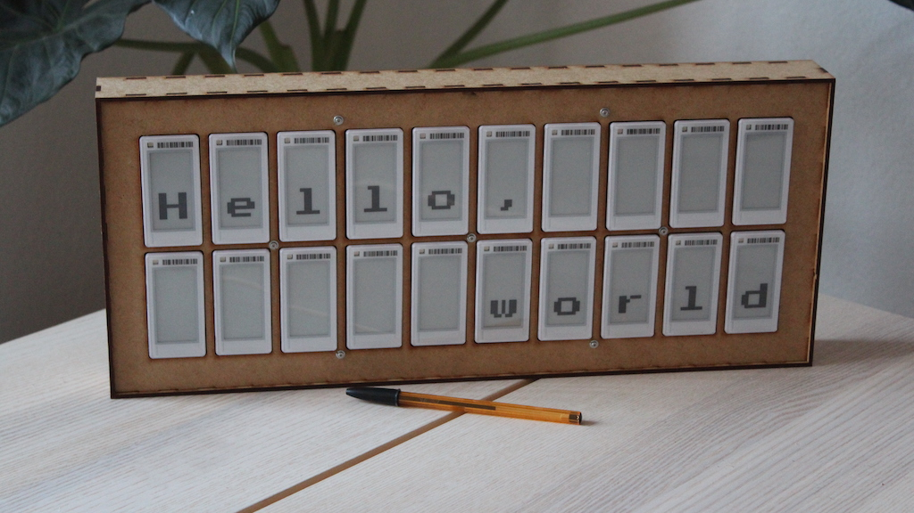

# elink

## Repository organization

| Directory                                    | Description                                                                                              |
| -------------------------------------------- | -------------------------------------------------------------------------------------------------------- |
| [`code/`](./code)                            | Firmware for the displays - based on [atc1441/ATC_TLSR_Paper](https://github.com/atc1441/ATC_TLSR_Paper) |
| [`clients/python-cli`](./clients/python-cli) | A complete Python command line client for elink                                                          |
| [`clients/web/`](./clients/web)              | A simple web client for elink. Supports only drawing text via BLE                                        |
| [`case/`](./case)                            | Fabrication files for the case - SVGs templates for laser cutting and 3D-printable supports              |

# License

The code is released under the MIT license, and fabrication files (STL, SVGs) under [CC BY-NC-ND 4.0](https://creativecommons.org/licenses/by-nc-nd/4.0/).
